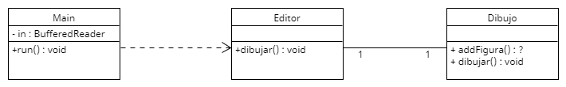

# Sesión 3. editor.Editor

En esta práctica vamos a trabajar con un editor de figuras en línea de ordenes. El editor podrá tener 3 tipos de figuras:
- **Cuadrados**
    - El cuadrado se definirá con las coordenadas de la esquina superior izquierda, el ancho y el alto.
    - Para seleccionar un cuadrado habra que hacer click en un punto cuyas coordenadas x e y cumplan:
    ``` (esquina.x <= x && x <= esquina.x + ancho) && (esquina.y <= y && y <= esquina.y + alto) ```
- **Círculos**
    - El círculo se definirá con las coordenadas del céntro y su radio.
    - Para seleccionar un cuadrado habra que hacer click en un punto cuyas coordenadas x e y cumplan:
    ``` Math.sqrt(Math.pow(x - centro.x, 2) + Math.pow(y - centro.y, 2)) < radio ```
- **Triángulos**
    - El triángulo se definirá con 3 coordenadas correspondientes a los 3 vértices.
    - Para simplificar el funcionamiento del editor, un triángulo se modificará la lógica para seleccionarlo y se considerará que se selecciona sólo cuando se haga click en uno de sus vértices.

Todo el proceso de edición se simulará con órdenes en la terminal:
- La orden ```cuadrado``` comenzará el proceso de crear un cuadrado. Para crear un cuadrado habra que hacer click en un punto y soltar en otro distinto. Con esos dos puntos se obtendrán las coordenadas del vertice superior izquierdo y del tamaño que define el cuadrado.
- La orden ```circulo``` comenzará el proceso de crear un círculo. La creación del círculo será idéntica a la del cuadrado. Se hará click en un punto y se soltará en otro. El centro de los dos puntos será el centro del círculo y la distancia entre los puntos será el diámetro.
- La orden ```triangulo``` comenzará el proceso de crear un triángulo. La creación del triángulo consistirá en hacer click en 3 puntos. Cuando se haya hecho click en el tercer punto se creará el triángulo.
- La orden ```seleccionar``` volverá a la herramienta por defecto que sirve para seleccionar y mover una figura. También se volverá a esta herramienta al terminar el proceso de creación de cualquier figura. para mover una figura habrá que hacer click dentro de la figura y arrastrar la figura hasta soltar el click. La figura se desplazará lo mismo que se desplace el ratón.

Para emular las acciones del ráton hay tres órdenes: ```pulsar```, ```mover``` y ```soltar```. Todas esas 3 órdenes reciben un argumento x e y.

El código inicial de esta práctica no funciona, pero en el campus virtual tendréis un ejecutable para ver el funcionamiento del programa.

Además, en esta práctica tenéis el diagrama UML del código inicial por si es de utilidad. Podéis editar el diagrama utilizando el fichero con extensión .uxf. Se puede editar con la herramienta [UMLet](https://www.umlet.com), que dispone de versión instalable, plugins para diferentes IDEs y versión web.


---
## ✨ Búsqueda de la Solución

> **Patrón Factory Method**

Vamos a ir repasando todas las clases que tenemos hasta ahora:

<details>
<summary>main.main.Main</summary>
Clase principal con la creación de un `editor.Editor` y la puesta en marcha del mismo

```java
public class Main {

  public static void main(String[] args) throws IOException {
    editor.Editor editor = new editor.Editor();
    editor.run();
  }
}
```
</details>

<details>
<summary>editor.Editor</summary>
Clase que contiene todas las responsabilidades (excepto las del Dibujo): comandos, que ejecutar en cada caso,...  
Esta clase es la que deberemos de completar antes de poder refactorizar el código.

```java
public class Editor {

  public Editor() {
    setDibujo(new Dibujo());
  }

  public void run() throws IOException {

    System.out.println("Comandos de Herramientas: cuadrado | circulo | triangulo | seleccion");
    System.out.println("Comandos de Ratón: pinchar x,y | mover x,y | soltar x,y");
    System.out.println("Otros Comandos: dibujar | exit");

    BufferedReader in = new BufferedReader(new InputStreamReader(System.in));

    do {
      System.out.print(">");
      String[] line = in.readLine().split("[ ,]");

      if (line[0].equals("exit"))
        return;
      if (line[0].equals("cuadrado"))
        ; //	?
      else if (line[0].equals("circulo"))
        ; //	?
      else if (line[0].equals("triangulo"))
        ; //	?
      else if (line[0].equals("seleccion"))
        ; //	?
      else if (line[0].equals("pinchar")) {
        int x = Integer.parseInt(line[1]);
        int y = Integer.parseInt(line[2]);
        //	?
      } else if (line[0].equals("mover")) { // Esto es mover el ratón
        int x = Integer.parseInt(line[1]);
        int y = Integer.parseInt(line[2]);
        //	?
      } else if (line[0].equals("soltar")) {
        int x = Integer.parseInt(line[1]);
        int y = Integer.parseInt(line[2]);
        //	?
      } else if (line[0].equals("dibujar"))
        dibujar();
      else
        System.out.println("Comando no válido");

    } while (true);
  }

  //$ Métodos del dibujo -----------------------------

  public void setDibujo(Dibujo dibujo) {
    this.dibujo = dibujo;
  }

  public Dibujo getDibujo() {
    return dibujo;
  }

  public void dibujar() {
    // Dibujar menú
    // Dibujar barra de herramientas lateral
    // Dibujar línea de estado
    dibujo.dibujar();
  }

  private Dibujo dibujo;
}
```
</details>

<details>
<summary>Dibujo</summary>
Clase donde tendremos una lista de Figuras que se podrán añadir al Dibujo, para luego poder dibujarlas

```java
public class Dibujo {

	/*
	public addFigura(...) {
		// TO DO
	}
	*/

  public void dibujar() {
    // Dibujar las figuras que contenga
  }

}
```
</details>

Con todo esto, nos hemos dado cuenta ya de que necesitaremos una Interfaz ``Figura`` que implementarán todas nuestras
figuras. Esto es porque nuestras ``figuras`` han de saberse dibujar así mismas y se deben de añadir al `Dibujo`.

<details>
<summary>Figura</summary>
Interfaz Figura que implementarán todas ellas que deban saber dibujarse

```java
// Interfaz Figura: todas las figuras saben dibujarse
public interface Figura {
  void dibujar();
}
```
</details>

<details>
<summary>Dibujo</summary>

```java
public class Dibujo {

  // Lista de Figuras de nuestro dibujo
  private List<Figura> figuras = new ArrayList<Figura>();

  /**
   * Añadimos una nueva figura a nuestro dibujo
   * @param figura Figura para añadir a nuestra lista de figuras
   */
  public void addFigura(Figura figura) {
    figuras.add(figura);
  }

  /**
   * Dibujamos todas las figuras que contenga el Dibujo
   */
  public void dibujar() {
    for (Figura figura : figuras) {
      figura.dibujar();
    }
  }
}
```
</details>

Si nos fijamos en el Ejecutable que tenemos, los cuadrados tienen como atributos una `x`, una `y`, el `ancho` y la 
`altura`; con todo eso, ya podemos dibujar los Cuadrados:
<details>
<summary>Cuadrado</summary>

```java
public class Cuadrado implements Figura{

  private int x, y, ancho, alto;

  public Cuadrado(int x, int y, int ancho, int alto) {
    this.x = x;
    this.y = y;
    this.ancho = ancho;
    this.alto = alto;
  }

  @Override
  public void dibujar() {
    System.out.println("Cuadrado: x = " + x + ", y = " + y + ", ancho = " + ancho + ", alto = " + alto);
  }
}
```
</details>

Los Circulos tienen un punto para el `centro` y el `radio`:
<details>
<summary>Circulo</summary>

```java
public class Circulo implements Figura{

  private Point centro;
  private int radio;

  public Circulo(Point centro, int radio) {
    this.centro = centro;
    this.radio = radio;
  }

  @Override
  public void dibujar() {
    System.out.println("Círculo: centro = " + centro + ", radio = " + radio);
  }
}
```
</details>

Y los triangulos tienen tres puntos, que se corresponden con los vertices
<details>
<summary>Triangulo</summary>

```java
public class Triangulo implements Figura{

  private Point v1, v2, v3;

  public Triangulo(Point v1, Point v2, Point v3) {
    this.v1 = v1;
    this.v2 = v2;
    this.v3 = v3;
  }

  @Override
  public void dibujar() {
    System.out.println("Triangulo: v1 = " + v1 + ", v2 = " + v2 + ", v3 = " + v3);
  }
}
```
</details>

Lo primero que haremos será la funcionalidad de crear las figuras 
- Para crear un `Cuadrado` necesitamos pinchar en un punto, y soltar en otro
- Para crear un `Circulo` necesitamos pinchar en un punto y soltar en otro (igual que el cuadrado)
- Para crear un `Triangulo` necesitamos pinchar 3 veces

Para conseguir diferenciar si estamos creando un cuadrado, un circulo o un triangulo creamos un nuevo atributo: 
`herramientaActual`.
````java
public class Editor {

    // Creamos un nuevo atributo para saber cual es la herramienta actual que estamos utilizando
    private String herramientaActual;
    
    //...
}
````

Además, necesitaremos tambien unos atributos auxiliares para crear el cuadrado, el circulo y el triangulo: para saber 
donde se pincho la primera vez:
````java
public class Editor {

    // Creamos un nuevo atributo para saber cual es la herramienta actual que estamos utilizando
    private String herramientaActual;

    // Creamos estos atributos para poder crear los cuadrados, los circulos y los triangulos
    private int initialX, initialY;

    private Point[] verticesTriangulo = new Point[3];
    private int numeroVertices = 0;

    //...
}
````

Y con todo esto ya podremos crearlos:
````java
public class Editor {

  //...

  public void run() throws IOException {
    //...
    
    do {
      System.out.print(">");
      String[] line = in.readLine().split("[ ,]");

      // ...
      if (line[0].equals("cuadrado"))
        herramientaActual = "cuadrado";
      else if (line[0].equals("circulo"))
        herramientaActual = "circulo";
      else if (line[0].equals("triangulo"))
        herramientaActual = "triangulo";
      //...
      
      else if (line[0].equals("pinchar")) {
        int x = Integer.parseInt(line[1]);
        int y = Integer.parseInt(line[2]);
        if (herramientaActual.equals("cuadrado") || herramientaActual.equals("circulo")){
          initialX = x;
          initialY = y;
        }
        else if(herramientaActual.equals("triangulo")){
          verticesTriangulo[numeroVertices] = new Point(x, y);
          numeroVertices++;
          if(numeroVertices >= 3){
            Figura triangulo = new Triangulo(verticesTriangulo[0], verticesTriangulo[1], verticesTriangulo[2]);
            dibujo.addFigura(triangulo);
          }
        }
      }
      // ...
      else if (line[0].equals("soltar")) {
        int x = Integer.parseInt(line[1]);
        int y = Integer.parseInt(line[2]);
        if(herramientaActual.equals("cuadrado")){
          Figura cuadrado = new Cuadrado(initialX, initialY, x - initialX, y - initialY);
          dibujo.addFigura(cuadrado);
        }
        else if (herramientaActual.equals("circulo")){
          int radio = (x - initialX) / 2;
          int centroX = initialX + radio;
          int centroY = initialY + (y - initialY) / 2;
          Figura circulo = new Circulo(new Point(centroX, centroY), radio);
          dibujo.addFigura(circulo);
        }
      } 
      // ...
    } while (true);
  }

  // ...
}
````

Ahora solo necesitamos completar algunas cosas: como el mover y el soltar siendo la herramienta de selección:

<details>
<summary>editor.Editor</summary>

````java
public class Editor {

    // Creamos un nuevo atributo para saber cual es la herramienta actual que estamos utilizando
    private String herramientaActual = "seleccion";

    // Creamos estos atributos para poder crear los cuadrados, los circulos y los triangulos
    private int initialX, initialY;

    private Point[] verticesTriangulo = new Point[3];
    private int numeroVertices = 0;

    // Creamos estos atributos para poder ver si seleccionamos alguna figura
    private Figura figuraMovimiento;
    private int xRef;
    private int yRef;

    public Editor() {
        setDibujo(new Dibujo());
    }

    public void run() throws IOException {

        System.out.println("Comandos de Herramientas: cuadrado | circulo | triangulo | seleccion");
        System.out.println("Comandos de Ratón: pinchar x,y | mover x,y | soltar x,y");
        System.out.println("Otros Comandos: dibujar | exit");

        BufferedReader in = new BufferedReader(new InputStreamReader(System.in));

        do {
            System.out.print(">");
            String[] line = in.readLine().split("[ ,]");

            if (line[0].equals("exit"))
                return;
            if (line[0].equals("cuadrado"))
                herramientaActual = "cuadrado";
            else if (line[0].equals("circulo"))
                herramientaActual = "circulo";
            else if (line[0].equals("triangulo"))
                herramientaActual = "triangulo";
            else if (line[0].equals("seleccion"))
                herramientaActual = "seleccion";
            else if (line[0].equals("pinchar")) {
                int x = Integer.parseInt(line[1]);
                int y = Integer.parseInt(line[2]);
                if (herramientaActual.equals("cuadrado") || herramientaActual.equals("circulo")){
                    initialX = x;
                    initialY = y;
                }
                else if(herramientaActual.equals("triangulo")){
                    verticesTriangulo[numeroVertices] = new Point(x, y);
                    numeroVertices++;
                    if(numeroVertices >= 3){
                        Figura triangulo = new Triangulo(verticesTriangulo[0], verticesTriangulo[1], verticesTriangulo[2]);
                        dibujo.addFigura(triangulo);
                        // Volvemos a la herramienta por defecto
                        herramientaActual = "seleccion";
                    }
                }
                // Seleccionamos la figura
                else if(herramientaActual.equals("seleccion")){
                    xRef = x;
                    yRef = y;
                    figuraMovimiento = dibujo.getFigura(x, y);
                }
            } else if (line[0].equals("mover")) { // Esto es mover el ratón
                int x = Integer.parseInt(line[1]);
                int y = Integer.parseInt(line[2]);
                if(herramientaActual.equals("seleccion") && figuraMovimiento != null){
                    figuraMovimiento.mover(x-xRef, y-yRef);
                    xRef = x;
                    yRef = y;
                }
            } else if (line[0].equals("soltar")) {
                int x = Integer.parseInt(line[1]);
                int y = Integer.parseInt(line[2]);
                if(herramientaActual.equals("cuadrado")){
                    Figura cuadrado = new Cuadrado(initialX, initialY, x - initialX, y - initialY);
                    dibujo.addFigura(cuadrado);
                    // Volvemos a la herramienta por defecto
                    herramientaActual = "seleccion";
                }
                else if (herramientaActual.equals("circulo")){
                    int radio = (x - initialX) / 2;
                    int centroX = initialX + radio;
                    int centroY = initialY + (y - initialY) / 2;
                    Figura circulo = new Circulo(new Point(centroX, centroY), radio);
                    dibujo.addFigura(circulo);
                    // Volvemos a la herramienta por defecto
                    herramientaActual = "seleccion";
                }
                else if (herramientaActual.equals("seleccion") && figuraMovimiento != null){
                    figuraMovimiento.mover(x-xRef, y-yRef);
                    figuraMovimiento = null;
                }
            } else if (line[0].equals("dibujar"))
                dibujar();
            else
                System.out.println("Comando no válido");

        } while (true);
    }

    //$ Métodos del dibujo -----------------------------

    public void setDibujo(Dibujo dibujo) {
        this.dibujo = dibujo;
    }

    public Dibujo getDibujo() {
        return dibujo;
    }

    public void dibujar() {
        // Dibujar menú
        // Dibujar barra de herramientas lateral
        // Dibujar línea de estado
        if(herramientaActual.equals("triangulo")){
            System.out.println("Botón activo: Herramienta que crea triangulos");
        }
        else if(herramientaActual.equals("circulo")){
            System.out.println("Botón activo: Herramienta que crea circulos");
        }
        else if(herramientaActual.equals("cuadrado")){
            System.out.println("Botón activo: Herramienta que crea cuadrados");
        }
        else if(herramientaActual.equals("seleccion")){
            System.out.println("Botón activo: Herramienta de Selección");
        }

        dibujo.dibujar();
    }

    private Dibujo dibujo;
}
````
</details>

---
## Refactorización
Con todo esto ya podemos ejecutar el programa; el problema viene que este código es poco mantenible, dificil de entender
y de aumentar: si ahora añadimos una nueva herramineta para crear rombos, deberemos de modificar los ifs, elses que
tenemos... ¡UN ROLLO! Por eso, vamos a intentar refactorizarlo.  
Lo primero que debemos de fijarnos es que nuestro problema es la creación de objetos (así ya podemos entender que patrón
acabaremos usando). Pero antes de decidir el patrón, y programar a partir de él, vamos a ir poco a poco solucionando errores.  
- La clase ``editor.Editor`` tiene **muchas responabilidades** (creación de objetos, herramienta de selección, tiene atributos 
que no corresponden a un editor sino a clases concretas de objetos concretos: los `initialX` que tenemos por ejemplo para
poder crear los cuadrados, los circulos,...).  

Para solucionar este problema, vamos a crear una interfaz ``Herramienta`` que será la encargada de crear todos los objetos
concretos que queramos (tendrá las operaciones que tienen todas las herramientas: `pinchar`, `mover` y `soltar`):

````java
public interface Herramienta {
    void pinchar(int x, int y);
    void soltar(int x, int y);
    void mover(int x, int y);
}
````

De esta heredarán las clases concretas que crearán los objetos concretos de nuestro dominio: ``HerramientaCuadrado`` ➔ 
``Cuadrado``; `HerramientaCirculo` ➔ `Circulo`; `HerramientaTriangulo` ➔ `Triangulo`; ...

Lo primero que haremos será la operación de ``pinchar(int x, int y)``; solo tenemos que pasar lo que hicimos en los 
distintos condiciales a las clases nuevas:

````java
public class HerramientaCuadrado implements Herramienta {

    private int initialX, initialY;

    @Override
    public void pinchar(int x, int y) {
        this.initialX = x;
        this.initialY = y;
    }

    @Override
    public void soltar(int x, int y) {
        //...
    }

    @Override
    public void mover(int x, int y) {
        //...
    }
}
````

`````java
public class HerramientaCirculo implements Herramienta {

    private int initialX, initialY;

    @Override
    public void pinchar(int x, int y) {
        this.initialX = x;
        this.initialY = y;
    }

    @Override
    public void soltar(int x, int y) {
        //...
    }

    @Override
    public void mover(int x, int y) {
        //...
    }
}
`````
> ⚠️ **OJO** Podemos observar comportamiento parecido entre las herramientas del cuadrado y del circulo

````java
public class HerramientaTriangulo implements Herramienta {

    private Point[] verticesTriangulo = new Point[3];
    private int numeroVertices = 0;
    private editor.Editor editor;

    public HerramientaTriangulo(editor.Editor editor) {
        this.editor = editor;
    }

    @Override
    public void pinchar(int x, int y) {
        verticesTriangulo[numeroVertices] = new Point(x, y);
        numeroVertices++;
        if(numeroVertices >= 3){
            Figura triangulo = new Triangulo(verticesTriangulo[0], verticesTriangulo[1], verticesTriangulo[2]);
            editor.getDibujo().addFigura(triangulo);
            // Volvemos a la herramienta por defecto
            // TODO
        }
    }

    @Override
    public void soltar(int x, int y) {
      //...
    }

    @Override
    public void mover(int x, int y) {
        //...
    }
}
````

Además, nos fijamos que debemos de tener otra herramienta: la de selección; pero está será disinta a las demás, no tiene 
que crear ningún objeto concreto, solo tiene que hacer las operaciones de pinchar, mover y soltar, pero sin crear nada:
```java
public class HerramientaSeleccion implements Herramienta {

    private int xRef, yRef;
    private Figura figuraMovimiento;
    private editor.Editor editor;

    public HerramientaSeleccion(editor.Editor editor){
        this.editor = editor;
    }

    @Override
    public void pinchar(int x, int y) {
        xRef = x;
        yRef = y;
        figuraMovimiento = editor.getDibujo().getFigura(x, y);
    }

    @Override
    public void soltar(int x, int y) {
        //...
    }

    @Override
    public void mover(int x, int y) {
        //...
    }
}
```

Con todo esto podemos dejar el ``editor.Editor`` de esta forma:
````java
public class Editor {

    // Creamos un nuevo atributo para saber cual es la herramienta actual que estamos utilizando
    private String herramientaActual = "seleccion";
    private Herramienta herramienta;

    // Creamos estos atributos para poder crear los cuadrados, los circulos y los triangulos
    private int initialX, initialY;

    // Creamos estos atributos para poder ver si seleccionamos alguna figura
    private Figura figuraMovimiento;
    private int xRef;
    private int yRef;

    public Editor() {
        setDibujo(new Dibujo());
    }

    public void run() throws IOException {
        //...
        do {
            System.out.print(">");
            String[] line = in.readLine().split("[ ,]");

            if (line[0].equals("exit"))
                return;
            if (line[0].equals("cuadrado"))
                herramienta = new HerramientaCuadrado();
            else if (line[0].equals("circulo"))
                herramienta = new HerramientaCirculo();
            else if (line[0].equals("triangulo"))
                herramienta = new HerramientaTriangulo(this);
            else if (line[0].equals("seleccion"))
                herramienta = new HerramientaSeleccion(this);
            else if (line[0].equals("pinchar")) {
                int x = Integer.parseInt(line[1]);
                int y = Integer.parseInt(line[2]);
                herramienta.pinchar(x, y);
            } else if (line[0].equals("mover")) { // Esto es mover el ratón
               //...
            } else if (line[0].equals("soltar")) {
                // ...
            } else if (line[0].equals("dibujar"))
                dibujar();
            else
                System.out.println("Comando no válido");

        } while (true);
    }
    //...
}
````

> 🥳 Hemos conseguido quitar todas las sentencias condicionales que teniamos antes, por **una sola linea**

Seguimos ahora con la acción de mover: esta solo se puede activar si nuestra herramienta es ``HerramientaSeleccion``,
por lo que la implantaremos en dicha clase, y en el resto quedarán vacías, así si hacemos un `mover()` y estamos usando 
la herramienta del circulo no se hará nada:
````java
public class HerramientaSeleccion implements Herramienta {

    //...

    @Override
    public void pinchar(int x, int y) {
       //...
    }

    @Override
    public void soltar(int x, int y) {
        //...
    }

    @Override
    public void mover(int x, int y) {
        if(figuraMovimiento != null){
            figuraMovimiento.mover(x-xRef, y-yRef);
            xRef = x;
            yRef = y;
        }
    }
}
````

Y el resto de clases que implementen este metodo, lo dejamos vacío.

Además, para poder ver que funciona hemos tenido que añadir un nuevo atributo que será la herramienta por defecto: 
la herramienta de selección. Esto lo hemos hecho porque, como nos dice en el enunciado, después de crear una herramienta
deberemos de volver a la herramienta por defecto
```java
public class Editor {

    // Creamos un nuevo atributo para saber cual es la herramienta actual que estamos utilizando
    private String herramientaActual = "seleccion";
    private Herramienta herramienta, herramientaDefecto;

    //...

    public Editor() {
        setDibujo(new Dibujo());

        herramientaDefecto = herramienta = new HerramientaSeleccion(this);
    }

    public Herramienta getHerramientaDefecto() {
        return herramientaDefecto;
    }

    public void finHerramienta(){
        herramienta = herramientaDefecto;
    }

    public void run() throws IOException {

       //...
        do {
            System.out.print(">");
            String[] line = in.readLine().split("[ ,]");

            if (line[0].equals("exit"))
                return;
            if (line[0].equals("cuadrado"))
                herramienta = new HerramientaCuadrado();
            else if (line[0].equals("circulo"))
                herramienta = new HerramientaCirculo();
            else if (line[0].equals("triangulo"))
                herramienta = new HerramientaTriangulo(this);
            else if (line[0].equals("seleccion"))
                herramienta = new HerramientaSeleccion(this);
            else if (line[0].equals("pinchar")) {
                int x = Integer.parseInt(line[1]);
                int y = Integer.parseInt(line[2]);
                herramienta.pinchar(x, y);
            } else if (line[0].equals("mover")) { // Esto es mover el ratón
                int x = Integer.parseInt(line[1]);
                int y = Integer.parseInt(line[2]);
                herramienta.mover(x, y);
            } //...

        } while (true);
    }
    //...
}
```

> 🥳 Hemos vuelto a conseguir quitar las sentencias condicionales que teniamos antes, por **una sola linea**

Y finalmente vamos con la acción de soltar; para ello volvemos a hacer lo mismo que antes, cogemos lo que corresponda en 
cada condicional y lo pondremos en la clase de la herramienta que corresponda:
```java
public class HerramientaCuadrado implements Herramienta {

    private int initialX, initialY;
    private editor.Editor editor;

    public HerramientaCuadrado(editor.Editor editor) {
        this.editor = editor;
    }

    @Override
    public void pinchar(int x, int y) {
        this.initialX = x;
        this.initialY = y;
    }

    @Override
    public void soltar(int x, int y) {
        Figura cuadrado = new Cuadrado(initialX, initialY, x - initialX, y - initialY);
        editor.getDibujo().addFigura(cuadrado);
        // Volvemos a la herramienta por defecto
        editor.finHerramienta();
    }

    @Override
    public void mover(int x, int y) {
        // No se hace nada
    }
}
```

Y lo mismo con las otras clases, dejando el editor de esta forma:
