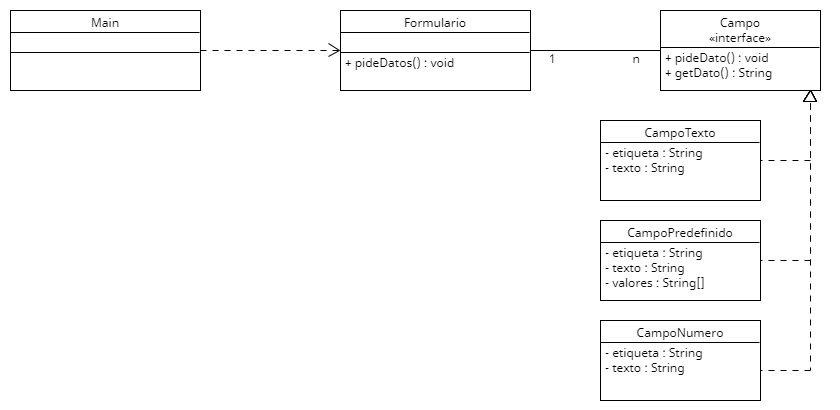

# Sesión 4. Validaciones

Esta sesión consiste en un formulario formado por diferentes campos con los que recabar información. Por el momento el formulario está compuesto por 4 campos que son validados de forma automática al introducir el dato para impedir que el usuario introduzca información incorrecta:
- *Nombre*. En el campo nombre sólo se puede introducir texto, así que fallará si se intenta añadir por ejemplo "123456".
- *Apellido*. El apellido tiene las mismas propiedades que el nombre, sólo se puede introducir texto0
- *Teléfono*. El campo del teléfono permitirá introducir sólo números.
- *Ciudad*. Para este campo habrá una lista de valores válidos que se puedan introducir. El formulario fallará si se introduce cualquier valor que no esté en la lista de valores permitido.

En todos estos validadores, cuando se introduzca un dato incorrecto y el validador falle, se le volverá a pedir el dato al usuario hasta que introduzca un valor correcto.

El código suministrado ya funciona con los campos indicados. Se pide rediseñar el código para minimizar las modificaciones que haya que hacer cuando se quieran añadir nuevos tipos de campos.

Una vez rediseñado se quieren añadir los siguientes campos:
- *Código de Producto*. Que permitirá introducir 4 caracteres (sin comprobar si sin texto o número).
- *Código Postal*. Que permitirá introducir sólo 5 dígitos.
- *Edad*. Que permitirá introducir sólo dígitos y su valor debe ser superior a 18.
- *Sueldo*. Que permitirá introducir sólo dígitos y su valos debe estar entre 800 y 1200.
- *Ubicación*. Que se podrá completar con una de las ciudades de la lista utilizada en el campo ciudad o con un código postal.
- *Código de Promoción*. En este campo hay dos posibilidades. Se puede completar con texto (sin importar su longitud) o con 3 dígitos.


Al igual que en la clase anterior, en está sesión también tenéis el diagrama UML del código inicial por si es de utilidad. Podéis editar el diagrama utilizando el fichero con extensión .uxf. Se puede editar con la herramienta [UMLet](https://www.umlet.com), que dispone de versión instalable, plugins para diferentes IDEs y versión web.


---
## ✨ Solución
> **Patrón Composite**

Si nos fijamos en las clases ``campos.CampoNumero``, `campos.CampoPredefinido` y `campos.CampoTexto` podemos observar que todas ellas hacen 
siempre lo mismo:
1. Inicalizan un BufferedReader
2. Dentro de un DoWhile miran
   - Inicializan una variable local ``valido``
   - Hacer un try/catch donde
     + Printean el nombre de la etiqueta junto con :
     + Leen por consola
     + **Comprueban si se cumple la condición**

Viendo que se hace esto siempre, podemos ya darnos cuenta de que se trata de un Template Method, donde la clase padre
hará todo lo común de las clases y cada clase concreta verificará si es valido:
```java
public abstract class AbstractCampo implements campos.Campo{

    private String etiqueta;
    private String texto;

    public AbstractCampo(String etiqueta){
        this.etiqueta = etiqueta;
    }

    public void pideDato(){
        BufferedReader consola = new BufferedReader(new InputStreamReader(System.in));

        boolean valido;
        do {
            valido = true;
            try {
                System.out.print(etiqueta + ": ");
                texto = consola.readLine();

                valido = esValido(texto);

            } catch (IOException ex) {
                System.out.println(ex);
            }
        } while (!valido);
    }

    public String getDato(){
        return texto;
    }

    public abstract boolean esValido(String texto);
}
```

Y las clases concretas quedarán de esta forma:
```java
public class CampoNumero extends AbstractCampo { 
    public CampoNumero(String etiqueta) {
        super(etiqueta);
    }
    
    @Override 
    public boolean esValido(String texto) {
        boolean valido = true;
        for (char ch : texto.toCharArray()) {
            if (!Character.isDigit(ch)) {
                valido = false;
                break;
            }
        }
        return valido;
    }
}
```

Y así con todas las clases de los campos que tengamos.
> 🥳 Ya hemos logrado la primera parte del problema! 

Ahora queremos añadir nuevos campos:
### Campo Codigo Producto
Lo que hemos hecho es crear una nueva clase que extienda de la clase abstracta anterior y sobreescribiendo el método 
``esValido``:
````java
public class CampoCodigoProducto extends AbstractCampo {

    public CampoCodigoProducto(String etiqueta) {
        super(etiqueta);
    }

    @Override
    public boolean esValido(String texto) {
        boolean valido = true;
        if(texto.length() != 4)
            valido = false;
        return valido;
    }
}
````

### Campo Codigo Postal
Nos damos cuenta que tanto el código postal como la edad tenemos que comprobar si son dígitos; por lo que vamos a hacer 
que ambos campos herenden de la clase padre ``CampoNumero`` y que esta tenga un metodo sin implementación en la clase padre
que sea ``addValidacion()`` que implementarán las clases hijas, como `CampoCodigoPostal` y `CampoCodigoEdad`:

```java
public class CampoNumero extends AbstractCampo {

	public CampoNumero(String etiqueta) {
		super(etiqueta);
	}

	@Override
	public boolean esValido(String texto) {
		boolean valido = true;
		for (char ch : texto.toCharArray()) {
			if (!Character.isDigit(ch)) {
				return false;
			}
		}
		valido = addValidacion(texto);
		return valido;
	}

	public boolean addValidacion(String texto) {
		return true;
	}
}
```

```java
public class CampoCodigoPostal extends CampoNumero {

    public CampoCodigoPostal(String etiqueta) {
        super(etiqueta);
    }

    @Override
    public boolean addValidacion(String texto) {
        if(texto.length() != 5)
            return false;
        return true;
    }
}
```

### Campo Edad
Con lo que hicimos antes, podemos añadir este campo mucho más facil sin duplicar código:
```java
public class CampoEdad extends CampoNumero{
    public CampoEdad(String etiqueta) {
        super(etiqueta);
    }

    @Override
    public boolean addValidacion(String texto) {
        if(Integer.parseInt(texto) < 18)
            return false;
        return true;
    }
}
```

### Campo Sueldo
Lo mismo para este campo, solo tenemos que añadir la validacion que queramos:
```java
public class CampoSueldo extends CampoNumero{

    public CampoSueldo(String etiqueta) {
        super(etiqueta);
    }

    @Override
    public boolean addValidacion(String texto) {
        return Integer.parseInt(texto) >= 800 && Integer.parseInt(texto) <= 1200;
    }
}
```

> 🤔 Empieza a ser un poco raro el tener que crear una clase por cada tipo de campo, ¿no? Hay una explosión de subclases, 
que además, son muchas parecidas entre ellas... ¿No podríamos hacerlo de otra forma?

**SÍ**, y es que deberíamos hacerlo de otra forma. Si nos fijamos, los campos "bases" son ``CampoTexto``, 
`CampoPredefinido` y `CampoNumero`; de estos lo que se hace es combinarlos entre ellos (en el caso del `CampoUbicación`, 
añadirles condiciones de mayores o menores,...). ¿Por qué no creamos mejor una clase que tenga como parámetros la etiqueta
y un ``Validable`` que podrán ser los campos bases o unos campos combinados, o unos campos con una condicion de más; nos
quedaría algo así:
```java
public interface Validable {
    boolean isValid(String texto);
}
```

````java
public class CampoNumero implements Validable { 
    @Override 
    public boolean isValid(String texto) {
        for (char ch : texto.toCharArray()) {
            if (!Character.isDigit(ch)) {
                return false;
            }
        }
        return true;
    }
}
````

```java
public class CampoPredefinido implements Validable {

    private String[] valores;

    public CampoPredefinido(String... valores) {
        this.valores = valores;
    }

    @Override
    public boolean isValid(String texto) {
        boolean valido = false;
        for (String valor : valores) {
            if (texto.toLowerCase().equals(valor.toLowerCase())) {
                valido = true;
                break;
            }
        }
        return valido;
    }
}
```

```java
public class CampoTexto implements Validable { 
    @Override 
    public boolean isValid(String texto) {
        boolean valido = true;
        for (char ch : texto.toCharArray()) {
            if (!Character.isLetter(ch)) {
                valido = false;
                break;
            }
        }
        return valido;
    }
}
```

Y nuestra clase Abstracta ya no será abstracta porque el metodo que teniamos antes ``esValido()`` ya no lo tendremos:
```java
public class AbstractCampo implements Campo{

    private String etiqueta;
    private String texto;
    private Validable validable;

    public AbstractCampo(String etiqueta, Validable validable) {
        this.etiqueta = etiqueta;
        this.validable = validable;
    }

    public void pideDato(){
        BufferedReader consola = new BufferedReader(new InputStreamReader(System.in));

        do {
            try {
                System.out.print(etiqueta + ": ");
                texto = consola.readLine();

            } catch (IOException ex) {
                System.out.println(ex);
            }
        } while (!validable.isValid(texto));
    }

    public String getDato(){
        return texto;
    }
}
```

Volvemos a empezar (jeje):
### Campo Codigo De Producto
```java
public class CampoLongitud implements Validable{

    private int longitud;

    public CampoLongitud(int longitud) {
        this.longitud = longitud;
    }

    @Override
    public boolean isValid(String texto) {
        return texto.length() == longitud;
    }
}
```
El codigo de producto solo comprueba que tenga una longitud, le da igual si son caracteres o numeros

### Campo Código Postal
Aquí tenemos que crear nuestro primer campo compuesto: ```CampoAnd```:
```java
public class CampoAnd implements Validable{

    private Validable validable1;
    private Validable validable2;

    public CampoAnd(Validable validable1, Validable validable2) {
        this.validable1 = validable1;
        this.validable2 = validable2;
    }

    @Override
    public boolean isValid(String texto) {
        return validable1.isValid(texto) && validable2.isValid(texto);
    }
}
```

Y así ya podemos crear el codigo postal:
```java
public class Main {

    public static void main(String[] args) {
        Formulario formulario = new Formulario();

        //...
        
        formulario.addCampo(new AbstractCampo("Código Postal", new CampoAnd(new CampoNumero(), new CampoLongitud(5))));

        formulario.pideDatos();
    }
}
```

### Campo Edad


